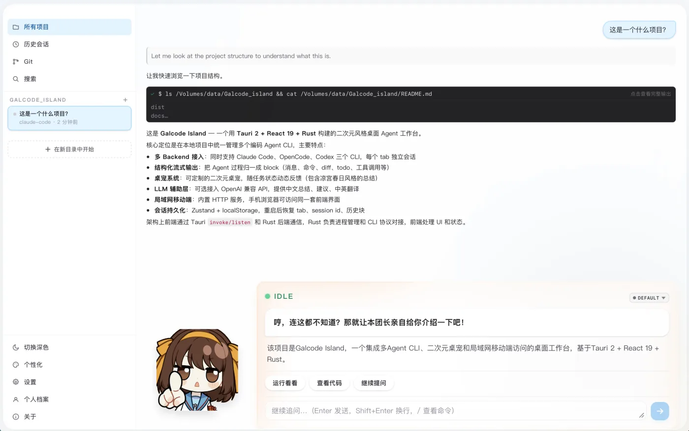
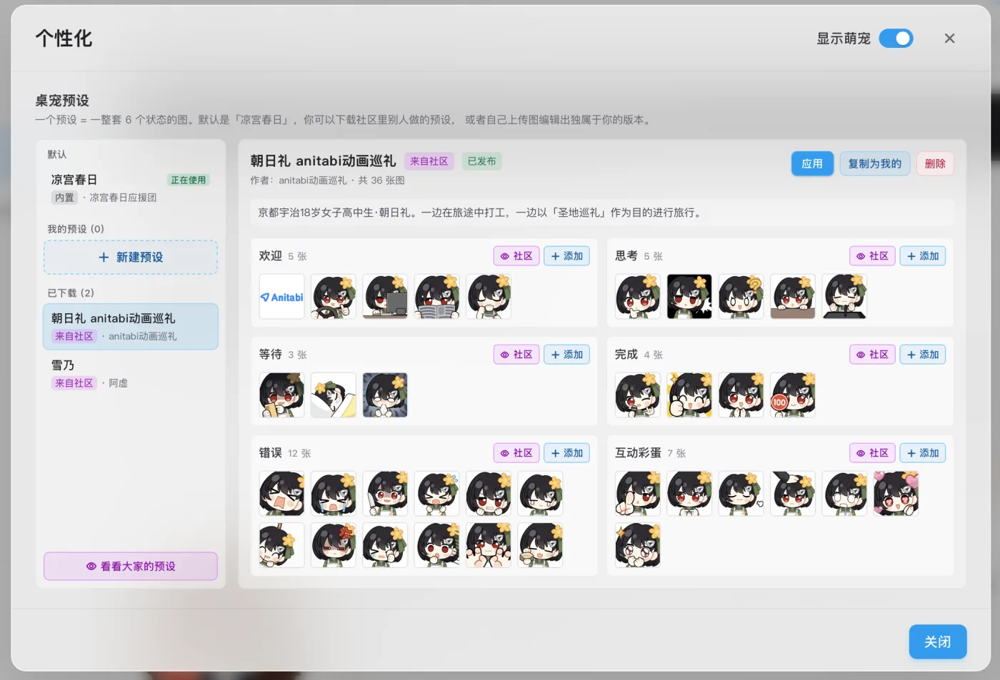

# Galcode Island

[简体中文](README.md)

Galcode is an anime-styled Agent workbench that combines practical development tooling with a highly customizable desktop-pet experience. It includes a full preset system for pet characters, animations, and persona settings, plus community features for downloading presets made by others or uploading your own.

| Agent Workbench | Personalization and Pet Presets |
| --- | --- |
|  |  |

Galcode does not replace the underlying coding agents or their execution harnesses. Instead, it connects directly to common Agent CLIs such as Codex, Claude Code, and OpenCode, then lets those tools do the actual work. Galcode focuses on the surrounding workflow: multi-project management, remote access, Git integration, session handling, search, and a richer desktop interface.

The anime presentation and role-playing layer are the starting point of the project, but they are intentionally kept outside the core Agent workflow. The goal is to make the tool pleasant and expressive without weakening or interfering with the real coding capability of the backend agents.

## Quick Start

### Use a Release Build

Download the build for your platform from the latest [Release](https://github.com/sjyinzju/Galcode_island/releases/latest). Galcode currently targets macOS and Windows.

### Build from Source

#### Requirements

- Node.js 20 or newer
- Rust toolchain
- Platform dependencies required by Tauri 2

#### Install Backend CLIs as Needed

```bash
npm install -g @anthropic-ai/claude-code
npm install -g @openai/codex
npm install -g opencode-ai
```

#### Run

```bash
git clone https://github.com/sjyinzju/Galcode_island.git
cd Galcode_island
npm install
npm run dev
```

## Feature Overview

- Unified access to the Claude Code, OpenCode, and Codex Agent CLIs.
- A customizable desktop-pet system with editable animations, character profiles, and full preset import/export through the community.
- Optional LLM integration for summaries, role-play-style feedback, next-step suggestions, and optional Chinese-English input translation.
- Sidebar-based management for multiple projects and multiple sessions.
- Session archiving when a conversation is closed, with restoration from history.
- Cross-project search and in-page search.
- LAN sharing for remote access from other devices, with a mobile-friendly UI and optional password protection. State is synchronized across devices, and desktop remains the authoritative source.

## Supported Backends

| Backend | Integration | Session Model | Notes |
| --- | --- | --- | --- |
| Claude Code | Long-running `claude -p` process using `stream-json` over stdin/stdout | One stream client per tab, resumed with the Claude session id | Starts with `--permission-mode acceptEdits`; supports model, effort, proxy, and binary configuration. |
| Codex | Shared `codex app-server` via JSON-RPC | One global app-server process, with one `thread_id` per tab | Uses `thread/start`, `thread/resume`, and `turn/start`; avoids multiple Codex processes competing for `~/.codex/auth.json`. |
| OpenCode | One `opencode serve` process per tab, bound to `127.0.0.1`, with ports allocated from `4096` upward | One OpenCode server process and session id per tab | Uses HTTP and SSE; supports provider, model, auth mode, proxy, and binary configuration. |

## Architecture

```text
React / Vite frontend
  - tabs, sidebars, search, stream blocks, result cards, pet character
  - Zustand stores persisted to localStorage
        |
        | Tauri invoke/listen
        v
Rust backend
  - ipc::commands / ipc::events
  - agent::manager handles lifecycle, routing, stop, and finalize
  - llm::* handles optional OpenAI-compatible translation and summarization
        |
        +-- Claude Code stream-json process
        +-- Codex shared app-server JSON-RPC process
        +-- OpenCode per-tab HTTP/SSE serve process
```

Runtime routing is based on `run_id`, which matches the frontend tab id. When a new turn starts in the same tab, Galcode first stops any still-running turn for that tab. Other tabs continue independently.

## Packaging

```bash
npm run build
```

Before the Tauri build starts, `scripts/prepare-runtime.mjs` runs. It installs the CLI npm packages into a temporary directory, then tries to copy the platform-specific binaries into:

```text
src-tauri/resources/runtime/<platform>-<arch>/<kind>/<binary>
```

This step is best effort. If a backend runtime is skipped or cannot be staged, the packaged app falls back to locating `claude`, `codex`, or `opencode` from the user's system `PATH`.

You can skip individual runtimes when needed:

```bash
node scripts/prepare-runtime.mjs --skip-claude
node scripts/prepare-runtime.mjs --skip-codex
node scripts/prepare-runtime.mjs --skip-opencode
```

Before distributing binaries, confirm that the bundled CLI tools allow redistribution under their respective licenses.
